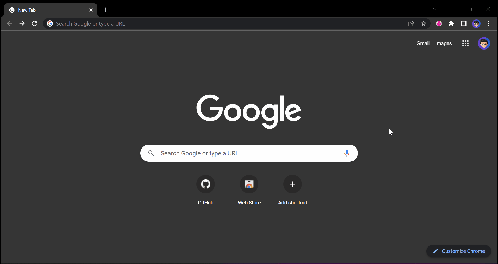

# Arweave Support (Extension) 

    

Adding standalone [Arweave](https://www.arweave.org/) native URL support for chromium based browsers without installing Arweave in your machine. 📦🌐🌊

## 😅 Motivation

This is based on my other project [IPFS Support Extension](https://github.com/warengonzaga/ipfs-support-extension) which is work for IPFS native URL. I just modified it to work with Arweave native URL. I decided to make another separate extension for Arweave because I don't want to make the IPFS Support Extension bloated with other features. I think it's better to make it separate extension so it will be more maintainable and easy to manage. I believe it will give freedom to the users to choose what they want to install in their browser depending on what they are using as their decentralized storage.

Shout out to [@codeninja819](https://github.com/warengonzaga/ipfs-support-extension/issues/8) for the suggestion to create this extension.

## 🤔 How It Works

<!--  -->

It checks your tab if you input Arwaeve native url (e.g. `ar://`) and then it modifies it and convert into Arweave public gateway URL so you can view the Arweave contents in any normal browser. Nothing fancy technology here, I'm just a lazy developer who likes making things easier.

Currently it depends on google search engine URL parameters and modify it accordingly.

## ✨ Features

- Arweave Gateway URL
  - `arweave.net/` (Default)
- Supported Browser
  - Google Chrome
  - Microsoft Edge
  - Brave Browser
- Supported IPFS Native URL
  - `ar://`
- Supported Search Engine
  - Google
  - Bing
  - DuckDuckGo
  - Brave Search
  - Yahoo

## 🐛 Issues

If you're facing any problem in using this open source project please let us know by [creating an issue here](https://github.com/warengonzaga/arweave-support-extension/issues/new). We're here to help you!

## 📋 Code of Conduct

Read the open source project's [code of conduct](./code_of_conduct.md).

## 📃 License

This open source project is licensed under [GNU General Public License v3](https://opensource.org/licenses/GPL-3.0).

## 🍀 Sponsor

> Love what I do? Send me some [love](https://github.com/sponsors/warengonzaga) or [coffee](https://buymeacoff.ee/warengonzaga)!? 💖☕
>
> Can't send love or coffees? 😥 Nominate me for a **[GitHub Star](https://stars.github.com/nominate)** instead!
> Your support will help me to continue working on open-source projects like this. 🙏😇

## 📝 Author

This open source project is developed and maintained by **[Waren Gonzaga](https://github.com/warengonzaga)**, with the help of awesome [contributors](https://github.com/warengonzaga/arweave-support-extension/graphs/contributors).

---

💻💖☕ by [Waren Gonzaga](https://warengonzaga.com) | [He is Awesome](https://www.youtube.com/watch?v=HHrxS4diLew&t=44s) 🙏
